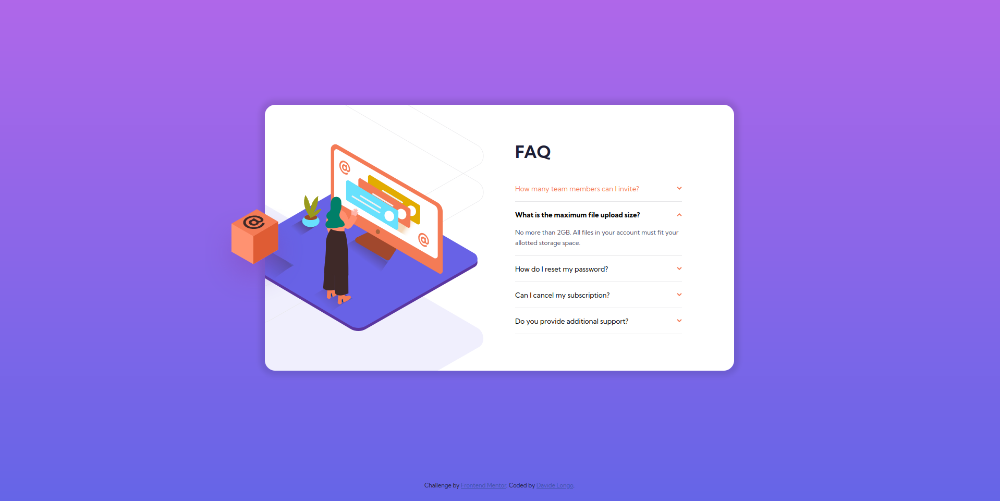
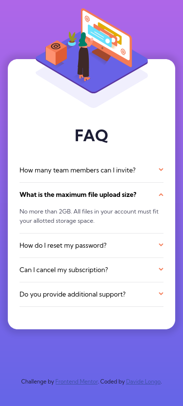

# Frontend Mentor - FAQ accordion card solution

This is a solution to the [FAQ accordion card challenge on Frontend Mentor](https://www.frontendmentor.io/challenges/faq-accordion-card-XlyjD0Oam). Frontend Mentor challenges help you improve your coding skills by building realistic projects. 

## Table of contents

- [Overview](#overview)
  - [The challenge](#the-challenge)
  - [Screenshot](#screenshot)
  - [Links](#links)
- [My process](#my-process)
  - [Built with](#built-with)
  - [What I learned](#what-i-learned)
  - [Useful resources](#useful-resources)
- [Author](#author)

## Overview

### The challenge

Users should be able to:

- View the optimal layout for the component depending on their device's screen size
- See hover states for all interactive elements on the page
- Hide/Show the answer to a question when the question is clicked

### Screenshot

### Links

- [Solution URL](https://github.com/davidelng/5-faq-accordion-card)
- [Live Site URL](https://davidelng.github.io/5-faq-accordion-card/)

## My process

### Built with

- Semantic HTML5 markup
- CSS custom properties
- Flexbox
- Mobile-first workflow
- JavaScript

### What I learned

- Better usage of rem instead of pixel
- How to make an accordion!

### Useful resources

- [Coder Coder's Solution](https://www.youtube.com/watch?v=FboXxLxg8eo) - Coder Coder take on this challenge helped me with the overall styling, but I felt like the JS part was unnecessarely over-complicated hence I took a simpler approach.

## Author

- Frontend Mentor - [@davidelng](https://www.frontendmentor.io/profile/davidelng)
